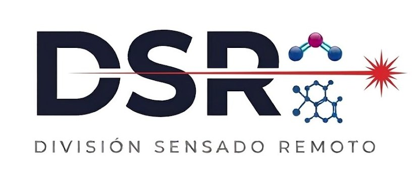
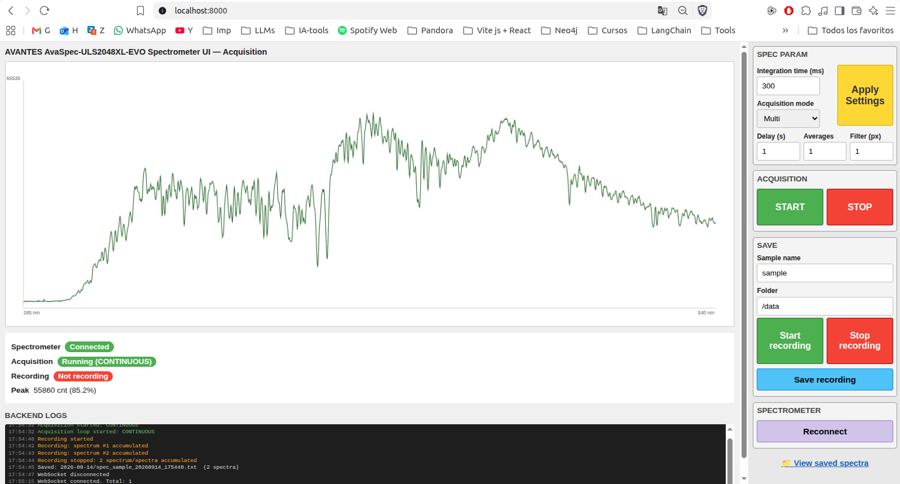
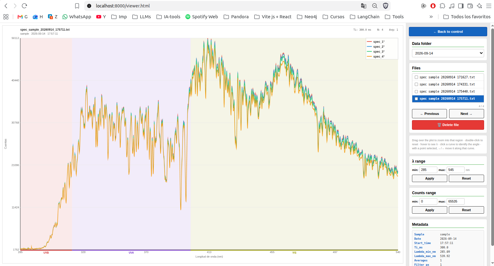

# UI Avantes — Acquisition backend + frontend for Avantes spectrometers

Dockerized application to control an Avantes spectrometer (AvaSpec SDK /
`libavs.so`) and acquire spectra from the browser. Acquisition only:
integration time, delay between spectra, averaging and smoothing filter.
Does not control motors or a shutter.

## 🏗️ Architecture

```
┌───────────────────────────────┐
│         Docker container       │
│         (Ubuntu 22.04)         │
│                                 │
│  FastAPI + libavs.so  ◄──USB──┼── Avantes spectrometer
│  Static frontend (HTML/JS)     │
└──────────────┬──────────────────┘
               │ http://localhost:8000
         Browser (any OS)
```

The backend runs inside the container and controls the hardware over USB;
the frontend is served on the same port and opens from any browser that can
reach that IP/port — no hotspot or dedicated network required.

## 📦 Requirements

- Docker and Docker Compose.
- Avantes spectrometer connected via USB to the machine running Docker.
- The installer `vendor/avantes/libavs_9.14.0.0-0_amd64.deb` (included in
  the repo) — proprietary Avantes SDK, don't redistribute it outside this use.

### Installing Docker

**Linux** (recommended — see below for why it has to be the native engine,
not Docker Desktop):

```bash
curl -fsSL https://get.docker.com | sudo sh
sudo usermod -aG docker $USER   # log out and back in for this to take effect
```

That installs Docker Engine (`docker-ce`) plus the `docker compose` plugin.
Full per-distro instructions: https://docs.docker.com/engine/install/.
Verify with:

```bash
docker --version
docker compose version
```

**Windows**: install
[Docker Desktop for Windows](https://docs.docker.com/desktop/install/windows-install/)
(it sets up WSL2 if you don't already have it). To actually see the
spectrometer from inside the container you'll also need
[`usbipd-win`](https://github.com/dorssel/usbipd-win) — see the USB section
below.

**macOS**: install
[Docker Desktop for Mac](https://docs.docker.com/desktop/install/mac-install/).
Fine for trying out the UI without hardware; USB passthrough to a real
spectrometer isn't reliably supported (see below).

### USB access by operating system

The container needs direct access to the spectrometer's USB device:

- **Linux (recommended)**: native Docker Engine (`dockerd` as a system
  service, `apt install docker.io`/`docker-ce`) runs on the host kernel and
  the USB bus passes straight through to the container. Same base that
  already worked on the Raspberry Pi with Ubuntu, just now it runs on any
  PC/mini PC with Linux + Docker.
- **Windows**: Docker Desktop runs on a VM (WSL2), so USB isn't visible by
  default. The device needs to be shared into WSL2 with
  [`usbipd-win`](https://github.com/dorssel/usbipd-win) before starting the
  container.
- **macOS**: Docker Desktop also runs in a VM with no stable USB passthrough
  path. Not directly supported; Linux or Windows+usbipd-win is recommended
  for actual use with the instrument.

### udev rule (Linux host)

So the host user has permission on the USB device before it's passed to the
container:

```bash
sudo cp docker/99-avantes.rules /etc/udev/rules.d/
sudo udevadm control --reload-rules
sudo udevadm trigger
```

Unplug and replug the spectrometer after installing the rule.

⚠️ **If the spectrometer disconnects/reconnects or loses power while the
container is running**, Linux assigns it a new USB device number (e.g.
`Bus 004 Device 002` → `Bus 004 Device 009`). The container fixes its
`/dev/bus/usb/...` nodes at creation time, so it's left with the old node
and the frontend's "Reconnect" button won't be enough to see it. Fix:
recreate the container (a plain restart isn't enough):

```bash
docker compose up -d --force-recreate
```

## 🚀 Usage

### 1. Get it

**Recommended — clone the repo:**

```bash
git clone https://github.com/mraponi74/UI_Avantes.git
cd UI_Avantes
```

This gets everything needed to run it: `docker-compose.yml`, the udev rule,
`.env.example`, and the Avantes SDK installer used to build the image. No
GitHub account needed — the repo is public, just `git clone` the URL above
(if `git` isn't installed: `sudo apt install git` on Linux, or
[Git for Windows](https://git-scm.com/download/win) / `xcode-select
--install` on macOS).

**Alternative — pull the prebuilt image directly**, without cloning:

```bash
docker pull mraponi74/ui-avantes:latest
```

This alone won't run the container correctly, though — the spectrometer
needs the privileged USB bind mount and the `/data` volume that
`docker-compose.yml` sets up (see step 2 below). Cloning the repo is the
simpler path even if you don't intend to build the image yourself.

### 2. Build and start

```bash
docker compose up -d --build
```

This builds the image (Ubuntu 22.04 + Avantes SDK + backend + frontend) and
starts the container with:
- Port `8000` published on the host.
- `./data` (on the host) mounted at `/data` (inside the container) — spectra
  are saved there.
- The host's USB bus mapped into the container.

The image published on Docker Hub can also be used without building
locally — `docker-compose.yml` already points at
`mraponi74/ui-avantes:latest`, so `docker compose up -d` (without `--build`)
pulls and starts it directly.

If port `8000` is already in use on the host, `docker compose up` will fail
("port is already allocated"). It can be changed without editing the file,
via the `HOST_PORT` variable — through a `.env` file:

```bash
cp .env.example .env
# edit .env and set HOST_PORT=8080 (for example)
docker compose up -d
```

or on the fly, without `.env`:

```bash
HOST_PORT=8080 docker compose up -d
```

If `HOST_PORT` isn't set either way, it defaults to `8000`.

### 3. Open the frontend

```
http://localhost:8000
```

From another PC on the same network: `http://<host-IP>:8000`.

### 4. Workflow

1. Configure parameters (Ti, mode, delay, averages, filter, sample name,
   save folder) — every change applies automatically, no separate button
   needed.
2. **START** begins acquisition (`SINGLE` = one spectrum, `CONTINUOUS` = a
   loop with the configured delay).
3. The spectrum is plotted live over WebSocket.
4. **Start recording** / **Stop recording** control what gets buffered for
   saving, independently of START/STOP — check the backend log panel for a
   live count of accumulated spectra.
5. **Save recording** writes the accumulated spectra buffer to
   `/data/<date>/`.
6. **View saved spectra** opens a viewer to inspect the saved `.txt` files.

**Control panel** — parameters, acquisition/recording controls, live plot
and backend log panel, all on one page:



**Saved-spectra viewer** — browse, overlay and inspect (or delete) previously
saved files, with metadata and λ/counts range controls:



### View logs

```bash
docker compose logs -f
```

### Stop

```bash
docker compose down
```

## 🌐 REST API

| Method | Endpoint | Description |
|--------|----------|-------------|
| GET | `/api/status` | System status |
| POST | `/api/config` | Configure acquisition parameters |
| POST | `/api/start` | Start acquisition |
| POST | `/api/stop` | Stop acquisition |
| POST | `/api/record/start` | Start buffering acquired spectra |
| POST | `/api/record/stop` | Stop buffering acquired spectra |
| POST | `/api/save` | Save the buffered spectra |
| POST | `/api/spectrometer/reconnect` | Retry the USB connection to the spectrometer |
| GET | `/api/spectrometer/calibration` | Current wavelength calibration status |
| POST | `/api/spectrometer/calibration` | Save/apply a wavelength calibration for the connected unit |
| GET | `/api/logs` | Recent backend log lines |
| GET | `/api/viewer/folders` | Available data folders |
| GET | `/api/viewer/files` | Saved files in a folder |
| GET | `/api/viewer/file` | Contents of a saved file |
| DELETE | `/api/viewer/file` | Delete a saved file |
| WS | `/ws/spectrum` | Live spectrum streaming |

## 📊 Saved data format

One text file per acquisition, at `/data/<YYYY-MM-DD>/spec_<sample>_<date>_<time>.txt`:

```
# Avantes Spectrometer Acquisition
# Sample:         example
# Date:           2026-09-14
# Start_time:     10:30:00
# Ti_ms:          100.0
# Lambda_min_nm:  285.12
# Lambda_max_nm:  539.87
# Averages:       3
# Filter_px:      1
# N_spectra:      5
#
wl      spec_1      spec_2      ...
285.12  1234.00     1245.00     ...
...
```

## 🎯 Wavelength calibration

Each Avantes unit has its own factory wavelength calibration. This app
stores a per-serial-number calibration (4 polynomial coefficients + a
wavelength crop range) in `/data/calibrations.json`, persisted across
container recreations via the `/data` volume.

- On connect, the backend reads the spectrometer's serial number and looks
  it up in that file.
- Known serial → calibration applied automatically.
- Unknown serial → falls back to raw pixel index (not real wavelengths) and
  the frontend shows a form to enter the 4 coefficients (measured with a
  reference lamp/laser, same procedure as before) plus the wavelength crop
  range; saving it writes the entry for that serial and applies it
  immediately.

## 👨‍💻 Author


**Dr. BioEng. Marcelo Raponi**

División Sensado Remoto (DSR), DEILAP
CITEDEF-UNIDEF (MINDEF - CONICET)

Juan Bautista de La Salle 4397
B1063ALO, Villa Martelli
Buenos Aires, Argentina

Tel: +54 11 4709 8100 ext. 1533
www.citedef.gob.ar

## 📄 License

Academic/scientific use. The Avantes SDK (`vendor/avantes/`) is proprietary
software from Avantes BV, included only to make this image buildable.
